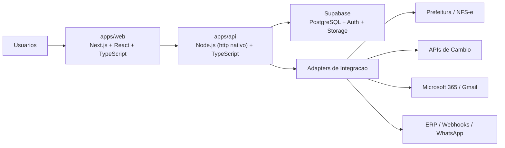

# Arquitetura

## Visao geral

O sistema foi desenhado como uma plataforma de backoffice para Comercio Exterior, com dois dominios centrais:

- Financeiro: cobrancas, NFS-e, cambio, faturamento, fluxo de caixa e consolidacao.
- Operacional: processos de importacao/exportacao, AWB, documentos, agenda, tracking e follow-up.

Ao redor desses dominios ficam os modulos de Cadastros, Integracoes, Relatorios, Administracao e RBAC.

## Principios

- Multiempresa desde o primeiro dia.
- Separacao explicita entre regras financeiras e operacionais.
- Clean Architecture no backend.
- Frontend orientado a dominio e nao a paginas soltas.
- Integracoes isoladas por adapters.
- Auditoria e rastreabilidade como requisitos basicos.

## Topologia



## Frontend

### Papel

- Entregar dashboards separados por area.
- Aplicar RBAC na navegacao e nas acoes.
- Permitir busca global, filtros, timelines e visualizacao documental.
- Ser responsivo e preparado para desktop operacional e uso executivo em mobile/tablet.

### Decisoes

- Next.js App Router para combinar rotas, rendering server-first e server actions futuras.
- Componentizacao por blocos de produto: shell, cards, tabelas, timelines, estados vazios.
- Dark mode nativo com tokens visuais reutilizaveis.

## Backend

### Camadas

```text
modules/
  finance/
  operations/
  reference/
  reports/
  admin/
shared/
  auth/
  config/
  context/
  http/
  supabase/
```

### Responsabilidades

- `modules/*`: casos de uso, contratos, handlers e regras do contexto.
- `shared/auth`: JWT, RBAC e autorizacao.
- `shared/context`: tenant atual, identidade do usuario e escopo.
- `shared/http`: middlewares, erros e padrao de resposta.
- `shared/supabase`: conexao lazy com Supabase.

## Multiempresa

- Cada registro de negocio carrega `organization_id`.
- O acesso a dados usa membership por usuario e organizacao.
- O filtro de tenant deve existir em 3 niveis:
  - UI: menu e acoes filtradas por perfil.
  - API: middleware de tenant + RBAC.
  - Banco: RLS no Supabase.

## Autenticacao e autorizacao

- Autenticacao via Supabase Auth + JWT.
- Perfis base:
  - `administrator`
  - `financeiro`
  - `operacional`
  - `comercial`
  - `diretor`
- Permissoes granulares por capacidade, nao so por tela.

## Integracoes

- Cada integracao entra por uma porta do dominio.
- O adapter concreto fica isolado por provedor.
- Para NFS-e de Indaiatuba, o desenho precisa suportar coexistencia entre provider municipal e provider nacional.

## Assincronia e observabilidade

- Filas assicronas para emissao de documentos, OCR, webhooks, e-mails em lote e sincronizacao de cambio.
- Logs estruturados por `trace_id`, `organization_id`, `process_id` e `document_id`.
- Eventos relevantes:
  - emissao/cancelamento de NFS-e
  - criacao/edicao de cobrancas
  - mudanca de status operacional
  - upload e versionamento documental
  - login, exportacao e alteracao de permissao

## Seguranca e LGPD

- Dados pessoais minimizados.
- Storage segregado por tenant.
- Politicas de retencao por tipo documental.
- Trilha de auditoria imutavel para acoes sensiveis.

## Estrategia de deploy

- `apps/web` em Vercel.
- `apps/api` em Vercel Functions.
- Banco, Auth e Storage via Supabase.
- Ambientes:
  - `development`
  - `staging`
  - `production`

## Evolucao recomendada

- MVP: dashboards, processos, AWB, cobrancas, NFS-e, documentos e RBAC.
- V1: OCR, automacoes de e-mail, webhooks, analytics e exportacoes avancadas.
- Escala: filas dedicadas, data mart analitico, feature flags e observabilidade expandida.
