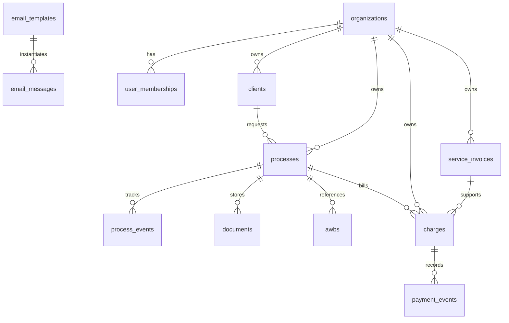

# Banco de Dados

## Estrategia

- PostgreSQL no Supabase.
- `organization_id` em todas as entidades de negocio.
- RLS por membership.
- Soft delete apenas onde houver exigencia operacional; historico principal fica em tabelas de evento e auditoria.

## Grupos de entidades

### Plataforma

- `organizations`
- `user_profiles`
- `user_memberships`
- `audit_logs`
- `integrations`
- `webhooks`
- `async_jobs`

### Cadastros

- `clients`
- `carriers`
- `agents`
- `ports`
- `airports`
- `currencies`
- `cost_centers`

### Operacional

- `processes`
- `process_events`
- `awbs`
- `documents`
- `document_versions`
- `tasks`

### Financeiro

- `fx_rate_tables`
- `fx_quotes`
- `service_invoices`
- `charges`
- `payment_events`
- `email_templates`
- `email_messages`

## Relacoes principais

## Pilares do schema

- Um processo concentra a operacao internacional.
- AWB e documentos orbitam o processo.
- Cobrancas e NFS-e podem nascer do mesmo processo, mas sao agregados financeiros independentes.
- Cambio fica separado em tabela mestre por cliente e em cotacoes historicas imutaveis.

## Multiempresa e seguranca

- A policy padrao e `organization_id IN current_user_memberships`.
- O papel do usuario e resolvido na API, enquanto o banco restringe fronteira de tenant.
- Exportacoes e downloads devem gravar auditoria.

## Arquivo de migracao

A modelagem inicial completa esta em:

- [202605240001_initial_schema.sql](../supabase/migrations/202605240001_initial_schema.sql)
