# Fluxos do Usuario

## 1. Processo operacional ate faturamento

```mermaid
flowchart LR
    A["Comercial cria oportunidade"] --> B["Operacional abre processo"]
    B --> C["Documentos sao anexados e versionados"]
    C --> D["AWB / BL vinculado ao processo"]
    D --> E["Tracking e SLA atualizados"]
    E --> F["Financeiro gera cobranca"]
    F --> G["NFS-e emitida"]
    G --> H["Recebimento conciliado"]
    H --> I["Processo encerrado com auditoria"]
```

## 2. Emissao de NFS-e

1. Financeiro seleciona processo ou servico avulso.
2. Sistema preenche tomador, servico, impostos e centro de custo.
3. Adapter fiscal envia o payload ao provedor configurado.
4. XML, PDF e protocolo ficam vinculados ao historico.
5. Falhas viram pendencia tratavel com reenvio.

## 3. Cobranca e follow-up

1. Usuario financeiro escolhe cliente, moeda, vencimento e metodo.
2. Sistema calcula valor final com taxa cambial e spread.
3. Template de e-mail e montado com variaveis dinamicas.
4. Envio e historico ficam no processo e no modulo financeiro.

## 4. Gestao documental

1. Operacional sobe invoice, packing list, AWB, DI ou contrato.
2. Sistema gera versao e metadados.
3. OCR e classificacao podem rodar em fila.
4. A auditoria registra usuario, horario e alteracoes.

## 5. Troca de tenant

1. Usuario autenticado escolhe empresa ativa.
2. Frontend troca contexto.
3. API valida membership e perfil.
4. RLS restringe consulta e mutacao no banco.
